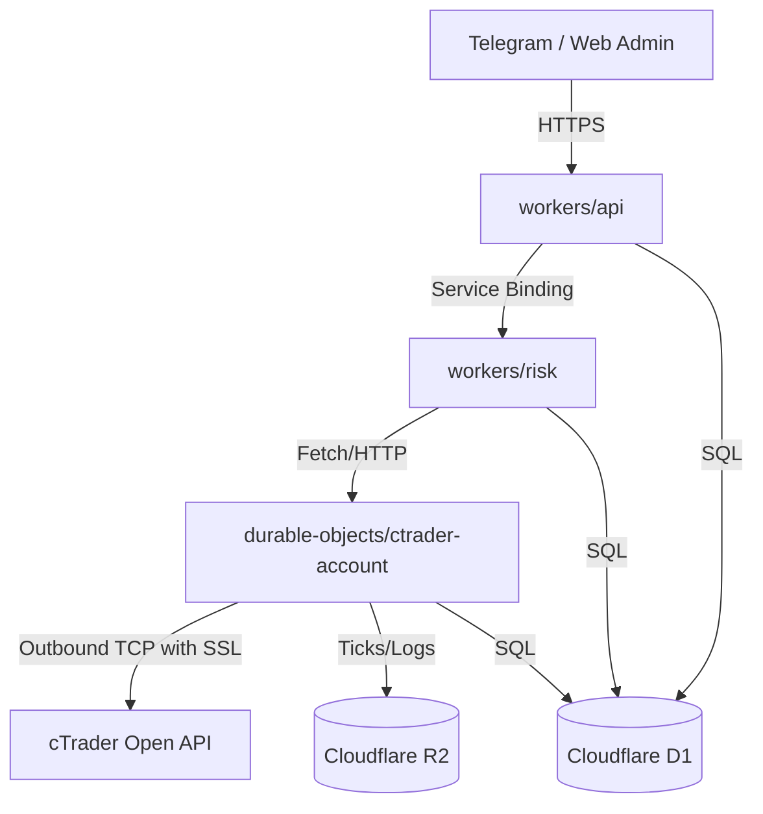

# Architecture Overview - Zebrabyte Trading Platform

The Zebrabyte Trading Platform is built to be a serverless, low-latency, Cloudflare-native algorithmic trading engine. It eliminates the need for virtual private servers (VPS) or always-on virtual machines by utilizing Cloudflare Workers, Durable Objects, and outbound TCP sockets.

## Components Relationship

### Component Details

1. **`workers/api`**: Exposes HTTPS REST endpoints. It authenticates users via cTrader OAuth 2.0, proxies requests to Durable Objects, serves the admin dashboard, and accepts order commands.
2. **`workers/risk`**: Decoupled risk engine worker. Validates all order execution commands against exposure, daily loss limit, news lock, and spread limits before executing them. Enforces idempotency using D1.
3. **`durable-objects/ctrader-account`**: Stateful Durable Object instantiated per cTrader account. It maintains a persistent TCP socket to the cTrader Open API demo/live servers. Performs heartbeat pinging, subscribes to tick price feeds, and buffers state in memory.
4. **`workers/telegram`**: Processes webhooks from the Telegram Bot. Resolves slash commands `/status`, `/accounts`, `/positions`, `/orders`, `/market`, `/calendar`, `/news`, and `/health`.
5. **`workers/news`**: Runs via Cron triggers. Fetches high-impact financial events and populates D1 for news lock evaluation.

## Outbound TCP Socket Connections in Workers

Cloudflare Workers support outbound TCP connections using `connect()` from `cloudflare:sockets`. The Durable Object utilizes this to connect directly to `demo.ctraderapi.com:5035`.
- Messages are framed using length-prefixed bytes (4-byte Big Endian integer).
- Payload is serialized using Protobuf (encoded/decoded via `@zebrabyte/ctrader-protocol`).
- In case of TCP stream termination or socket error, the Durable Object reconnects automatically using an exponential backoff retry schedule (1s, 2s, 4s, up to 30s limit).
